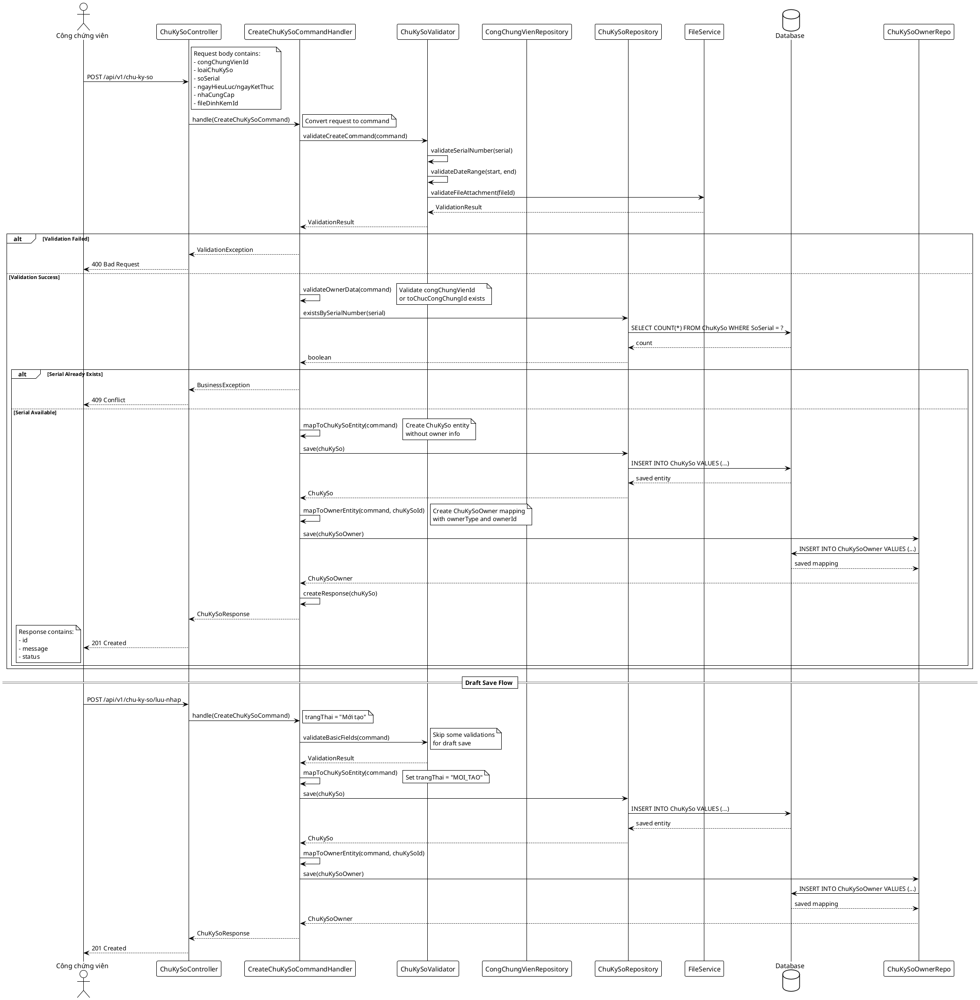

# Use Case - Đăng ký chữ ký số

## 1. Scope & Objectives

### 1.1. Overview
Use case này cho phép Công chứng viên và Nhân viên tại Tổ chức hành nghề công chứng (TCHNCC) đăng ký thông tin chữ ký số mới để phục vụ hoạt động hành nghề công chứng. Hệ thống sẽ lưu trữ thông tin đăng ký và cho phép duyệt hoặc từ chối đăng ký.

### 1.2. Scope
Phạm vi áp dụng của use case này là module Quản lý chữ ký số trong hệ thống NDS, bao gồm chức năng đăng ký mới, lưu nháp và trình duyệt thông tin chữ ký số.

### 1.3. Objectives
- Cho phép Công chứng viên/Nhân viên TCHNCC đăng ký chữ ký số mới
- Hỗ trợ lưu nháp thông tin đăng ký để hoàn thiện sau
- Kiểm tra tính hợp lệ của thông tin trước khi lưu
- Cung cấp luồng trình duyệt cho chữ ký số
- Lưu trữ lịch sử các thay đổi thông tin chữ ký số

---

## 2. Basic Design

### 2.1. Functional Requirements
- Hiển thị form đăng ký chữ ký số với các trường thông tin cần thiết
- Cho phép chọn loại chữ ký số (cá nhân/tổ chức)
- Cho phép chọn công chứng viên (đối với chữ ký số cá nhân)
- Kiểm tra tính hợp lệ của dữ liệu nhập vào
- Hỗ trợ lưu nháp và trình duyệt thông tin
- Hiển thị thông báo thành công/thất bại
- Cập nhật lịch sử thay đổi thông tin

### 2.2. Non-Functional Requirements
- Hiệu năng: Thời gian phản hồi dưới 2 giây cho các thao tác cơ bản
- Bảo mật: Chỉ người dùng có quyền mới có thể đăng ký chữ ký số
- Khả năng mở rộng: Hỗ trợ đăng ký cho nhiều loại chữ ký số khác nhau
- Tính sẵn sàng: Hệ thống hoạt động 99.5% thời gian
- Tính dễ sử dụng: Giao diện trực quan, dễ thao tác

### 2.3. Assumptions & Constraints
- Người dùng đã đăng nhập và có quyền đăng ký chữ ký số
- Công chứng viên đã có hồ sơ hành nghề hợp lệ trong hệ thống
- File đính kèm phải đúng định dạng (pdf, jpg, png)
- Ngày hết hạn phải lớn hơn ngày hiệu lực
- Mỗi công chứng viên/tổ chức chỉ có thể đăng ký một chữ ký số đang hiệu lực

---

## 3. Detailed Design

### 3.1. Overall Architecture
Kiến trúc tổng quan liên quan đến Use Case theo mô hình Clean Architecture:
- **Presentation Layer:** Controller và GraphQL Resolver xử lý request từ client
- **Application Layer:** Commands và Queries xử lý logic nghiệp vụ, bao gồm mapping với các entity nghiệp vụ
- **Domain Layer:** Entity ChuKySo (core domain) và các repository interface, không chứa logic nghiệp vụ cụ thể
- **Infrastructure Layer:** Implementation của repository và các service bên ngoài

**Nguyên tắc thiết kế:**
- Entity ChuKySo chỉ chứa thông tin core về chữ ký số
- Mapping với nghiệp vụ được thực hiện ở Application Layer thông qua bảng ChuKySoOwner
- Tuân thủ Clean Architecture và Domain-Driven Design (DDD)

### 3.2. Class / Module Design

**Domain Layer:**
- **ChuKySo** - Core domain entity chứa thông tin chữ ký số, không chứa nghiệp vụ
- **ChuKySoOwner** - Entity mapping giữa chữ ký số và chủ sở hữu (công chứng viên/tổ chức)
- **ChuKySoRepository** - Interface repository cho entity ChuKySo
- **ChuKySoOwnerRepository** - Interface repository cho entity mapping

**Application Layer:**
- **CreateChuKySoCommand** - Command chứa thông tin đăng ký chữ ký số bao gồm cả nghiệp vụ
- **CreateChuKySoCommandHandler** - Xử lý logic tạo mới, mapping và lưu cả ChuKySo và ChuKySoOwner
- **ChuKySoValidator** - Kiểm tra tính hợp lệ của dữ liệu đầu vào
- **ChuKySoApplicationService** - Service xử lý các business case phức tạp

**Presentation Layer:**
- **ChuKySoController** - REST API controller xử lý các request
- **ChuKySoResolver** - GraphQL resolver xử lý query và mutation

**Infrastructure Layer:**
- **ChuKySoRepositoryImpl** - Implementation repository sử dụng JPA/Hibernate  
- **ChuKySoOwnerRepositoryImpl** - Implementation repository cho mapping table

### 3.3. API/Interface Design
- **POST /api/v1/chu-ky-so**
- Request:
  ```json
  {
    "congChungVienId": "uuid",
    "toChucCongChungId": "uuid",
    "loaiChuKySo": "Cá nhân/Tổ chức",
    "soSerial": "string",
    "ngayHieuLuc": "2025-01-01",
    "ngayKetThuc": "2025-12-31",
    "nhaCungCap": "string",
    "fileDinhKemId": "uuid",
    "ghiChu": "string",
    "trangThai": "Mới tạo/Chờ duyệt"
  }
  ```
- Response:
  ```json
  {
    "id": "uuid",
    "message": "Đăng ký chữ ký số thành công",
    "status": "success"
  }
  ```
- Response Code: 201 Created

- **POST /api/v1/chu-ky-so/luu-nhap**
- Request:
  ```json
  {
    "congChungVienId": "uuid",
    "toChucCongChungId": "uuid",
    "loaiChuKySo": "Cá nhân/Tổ chức",
    "soSerial": "string",
    "ngayHieuLuc": "2025-01-01",
    "ngayKetThuc": "2025-12-31",
    "nhaCungCap": "string",
    "fileDinhKemId": "uuid",
    "ghiChu": "string",
    "trangThai": "Mới tạo"
  }
  ```
- Response:
  ```json
  {
    "id": "uuid",
    "message": "Lưu nháp thông tin chữ ký số thành công",
    "status": "success"
  }
  ```
- Response Code: 201 Created

### 3.4. Data Design

**Database:** PostgreSQL

**Table: ChuKySo (Core Domain Entity)**
- Id: uuid (Primary Key)
- SoSerial: varchar(255) (Not Null, Unique) - Số serial chữ ký số
- LoaiChuKySo: varchar(50) (Not Null) - Loại chữ ký số (CA_NHAN/TO_CHUC)
- NgayHieuLuc: date (Not Null) - Ngày hiệu lực
- NgayKetThuc: date (Not Null) - Ngày hết hạn  
- NhaCungCap: varchar(255) - Tên nhà cung cấp
- TrangThai: varchar(50) (Not Null) - Trạng thái (MOI_TAO/CHO_DUYET/DA_DUYET/TU_CHOI)
- ThoiGianGui: timestamptz - Thời gian gửi đăng ký
- NguoiGuiId: uuid - ID người gửi đăng ký
- ThoiGianDuyet: timestamptz - Thời gian duyệt
- NguoiDuyetId: uuid - ID người duyệt
- FileDinhKemId: uuid - ID file đính kèm
- CreatedAt: timestamptz (Not Null) - Audit field
- CreatedBy: uuid (Not Null) - Audit field  
- ModifiedAt: timestamptz (Not Null) - Audit field
- ModifiedBy: uuid (Not Null) - Audit field

**Table: ChuKySoOwner (Business Mapping Entity)**
- Id: uuid (Primary Key)
- ChuKySoId: uuid (Not Null, Foreign Key to ChuKySo.Id)
- OwnerType: varchar(20) (Not Null) - Loại chủ sở hữu ('CA_NHAN'/'TO_CHUC')
- OwnerId: uuid (Not Null) - ID của chủ sở hữu
- CreatedAt: timestamptz (Not Null)
- CreatedBy: uuid (Not Null)
- UNIQUE (ChuKySoId) - Mỗi chữ ký số chỉ có một chủ sở hữu

**Table: LichSuCapNhat (Audit Log)**
- Id: uuid (Primary Key)
- LoaiThaoTac: varchar(50) (Not Null) - Loại thao tác
- TruongThongtinCapNhat: varchar(255) - Trường thông tin được cập nhật
- TruongThongTinId: varchar(255) - ID đối tượng được cập nhật
- GiaTriCu: text - Giá trị cũ
- GiaTriMoi: text - Giá trị mới
- CreatedAt: timestamptz (Not Null)
- CreatedBy: uuid (Not Null)

### 3.5. Class Diagram

```plantuml
@startuml ClassDiagram_ChuKySoRegistration
!theme plain
skinparam classAttributeIconSize 0
skinparam classFontSize 10
skinparam packageStyle rectangle

package "Domain Layer" {
    class ChuKySo {
        - id: UUID
        - soSerial: String
        - loaiChuKySo: LoaiChuKySo
        - ngayHieuLuc: LocalDate
        - ngayKetThuc: LocalDate
        - nhaCungCap: String
        - trangThai: TrangThaiChuKySo
        - thoiGianGui: OffsetDateTime
        - nguoiGuiId: UUID
        - thoiGianDuyet: OffsetDateTime
        - nguoiDuyetId: UUID
        - fileDinhKemId: UUID
        - createdAt: OffsetDateTime
        - createdBy: UUID
        - modifiedAt: OffsetDateTime
        - modifiedBy: UUID
        + validate(): void
        + isExpired(): boolean
        + isActive(): boolean
    }

    class ChuKySoOwner {
        - id: UUID
        - chuKySoId: UUID
        - ownerType: OwnerType
        - ownerId: UUID
        - createdAt: OffsetDateTime
        - createdBy: UUID
    }

    enum OwnerType {
        CONG_CHUNG_VIEN
        TO_CHUC_CC
    }

    enum LoaiChuKySo {
        CA_NHAN
        TO_CHUC
    }

    enum TrangThaiChuKySo {
        MOI_TAO
        CHO_DUYET
        DA_DUYET
        TU_CHOI
    }

    interface ChuKySoRepository {
        + save(chuKySo: ChuKySo): ChuKySo
        + findById(id: UUID): Optional<ChuKySo>
        + findBySerialNumber(serial: String): Optional<ChuKySo>
        + existsBySerialNumber(serial: String): boolean
    }

    interface ChuKySoOwnerRepository {
        + save(owner: ChuKySoOwner): ChuKySoOwner
        + findByChuKySoId(id: UUID): Optional<ChuKySoOwner>
        + findByOwnerTypeAndOwnerId(type: OwnerType, ownerId: UUID): List<ChuKySoOwner>
    }
}

package "Application Layer" {
    class CreateChuKySoCommand {
        + congChungVienId: UUID
        + toChucCongChungId: UUID
        + loaiChuKySo: String
        + soSerial: String
        + ngayHieuLuc: LocalDate
        + ngayKetThuc: LocalDate
        + nhaCungCap: String
        + fileDinhKemId: UUID
        + ghiChu: String
        + trangThai: String
    }

    class CreateChuKySoCommandHandler {
        - chuKySoRepository: ChuKySoRepository
        - chuKySoOwnerRepository: ChuKySoOwnerRepository
        - chuKySoValidator: ChuKySoValidator
        + handle(command: CreateChuKySoCommand): ChuKySoResponse
        - validateCommand(command: CreateChuKySoCommand): void
        - mapToChuKySoEntity(command: CreateChuKySoCommand): ChuKySo
        - mapToOwnerEntity(command: CreateChuKySoCommand, chuKySoId: UUID): ChuKySoOwner
        - determineOwnerType(command: CreateChuKySoCommand): OwnerType
        - getOwnerId(command: CreateChuKySoCommand): UUID
    }

    class ChuKySoValidator {
        + validateCreateCommand(command: CreateChuKySoCommand): ValidationResult
        + validateSerialNumber(serial: String): boolean
        + validateDateRange(start: LocalDate, end: LocalDate): boolean
        + validateFileAttachment(fileId: UUID): boolean
        + validateOwnerData(command: CreateChuKySoCommand): boolean
    }

    class ChuKySoApplicationService {
        - chuKySoRepository: ChuKySoRepository
        - chuKySoOwnerRepository: ChuKySoOwnerRepository
        + getChuKySoByCongChungVien(congChungVienId: UUID): List<ChuKySoWithOwnerDTO>
        + getChuKySoByToChucCC(toChucId: UUID): List<ChuKySoWithOwnerDTO>
    }

    class ChuKySoResponse {
        + id: UUID
        + message: String
        + status: String
    }

    class ChuKySoWithOwnerDTO {
        + chuKySo: ChuKySo
        + ownerType: OwnerType
        + ownerId: UUID
        + ownerInfo: Object
    }
}

package "Presentation Layer" {
    class ChuKySoController {
        - createHandler: CreateChuKySoCommandHandler
        + createChuKySo(request: CreateChuKySoRequest): ResponseEntity<ChuKySoResponse>
        + saveDraft(request: CreateChuKySoRequest): ResponseEntity<ChuKySoResponse>
    }

    class ChuKySoResolver {
        - createHandler: CreateChuKySoCommandHandler
        + createChuKySo(input: CreateChuKySoInput): ChuKySoResponse
        + saveDraft(input: CreateChuKySoInput): ChuKySoResponse
    }
}

package "Infrastructure Layer" {
    class ChuKySoRepositoryImpl {
        - entityManager: EntityManager
        + save(chuKySo: ChuKySo): ChuKySo
        + findById(id: UUID): Optional<ChuKySo>
        + findBySerialNumber(serial: String): Optional<ChuKySo>
        + existsBySerialNumber(serial: String): boolean
    }

    class ChuKySoOwnerRepositoryImpl {
        - entityManager: EntityManager
        + save(owner: ChuKySoOwner): ChuKySoOwner
        + findByChuKySoId(id: UUID): Optional<ChuKySoOwner>
        + findByOwnerTypeAndOwnerId(type: OwnerType, ownerId: UUID): List<ChuKySoOwner>
    }
}

' Relationships
ChuKySoOwner }o-- ChuKySo : maps to
ChuKySoOwner --> OwnerType : uses
ChuKySo --> LoaiChuKySo : uses
ChuKySo --> TrangThaiChuKySo : uses

CreateChuKySoCommandHandler --> ChuKySoRepository : uses
CreateChuKySoCommandHandler --> ChuKySoOwnerRepository : uses
CreateChuKySoCommandHandler --> ChuKySoValidator : uses
CreateChuKySoCommandHandler ..> CreateChuKySoCommand : handles
CreateChuKySoCommandHandler ..> ChuKySoResponse : returns

ChuKySoApplicationService --> ChuKySoRepository : uses
ChuKySoApplicationService --> ChuKySoOwnerRepository : uses
ChuKySoApplicationService ..> ChuKySoWithOwnerDTO : returns

ChuKySoController --> CreateChuKySoCommandHandler : uses
ChuKySoController --> ChuKySoApplicationService : uses
ChuKySoResolver --> CreateChuKySoCommandHandler : uses
ChuKySoResolver --> ChuKySoApplicationService : uses

ChuKySoRepositoryImpl ..|> ChuKySoRepository : implements
ChuKySoOwnerRepositoryImpl ..|> ChuKySoOwnerRepository : implements

@enduml
```



### 3.6. Sequence Diagram



### 3.7. Security Considerations
- Chỉ người dùng có vai trò Công chứng viên hoặc Nhân viên TCHNCC mới có thể đăng ký chữ ký số
- Kiểm tra quyền truy cập dựa trên token JWT
- Mã hóa thông tin nhạy cảm trước khi lưu vào database
- Xác thực file đính kèm để tránh malicious file

### 3.8. Error Handling & Exceptions
- Hiển thị thông báo lỗi rõ ràng khi dữ liệu không hợp lệ
- Xử lý exception khi không thể lưu vào database
- Log lỗi để theo dõi và gỡ lỗi
- Trả về HTTP status code phù hợp với từng loại lỗi

### 3.9. Integration Requirements
- Tích hợp với module Quản lý thông tin công chứng viên để lấy danh sách công chứng viên
- Tích hợp với module Quản lý tổ chức hành nghề công chứng để lấy danh sách tổ chức
- Tích hợp với service lưu trữ file để xử lý file đính kèm
- Tích hợp với service gửi email/thông báo khi đăng ký thành công

---

## 4. Appendix
- [Activity Diagram](docs/general/ba/[NDS-E-00056] Quản lý chữ ký số/4.usecases/[NDS-U-00060] DangKy/AD_Sign_Create.puml)
- [Use Case Specification](docs/general/ba/[NDS-E-00056] Quản lý chữ ký số/4.usecases/[NDS-U-00060] DangKy/UC_Sign_Create.md)
- Database Schema